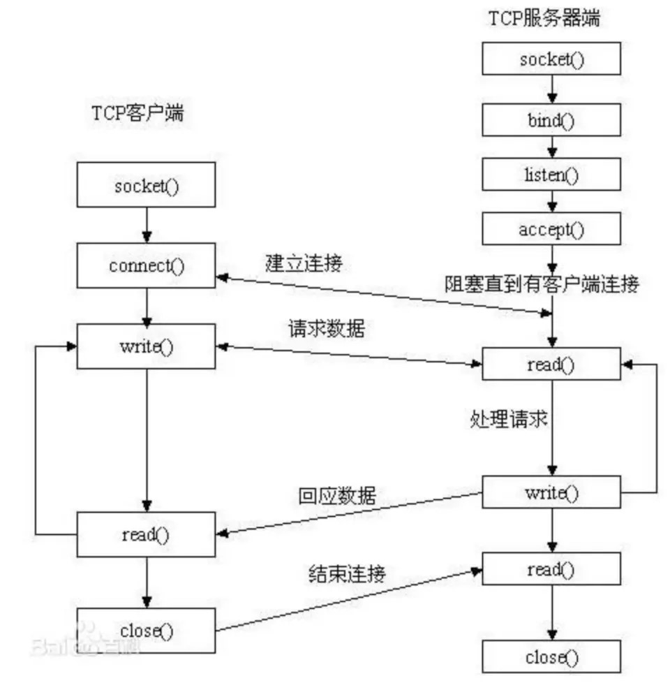

# Blog-Socket编程（基于Java实现）
总结Socket编程入门（基于Java实现）相关问题
socket，又称套接字，是在不同的进程间进行网络通讯的一种协议、约定或者说是规范。

对于socket编程，它更多的时候像是基于TCP/UDP等协议做的一层封装或者说抽象，是一套系统所提供的用于进行网络通信相关编程的接口。

## 建立socket的基本流程
我们以linux操作系统提供的基本api为例，了解建立一个socket通信的基本流程：

Socket示范
./BaseSocketClient.java  
注意这里的IO操作实现，我们使用了一个大小为MAX_BUFFER_SIZE的byte数组作为缓冲区，然后从输入流中取出字节放置到缓冲区，再从缓冲区中取出字节构建到字符串中去，这在输入流文件很大时非常有用，事实上，后面要讲到的NIO也是基于这种思路实现的。