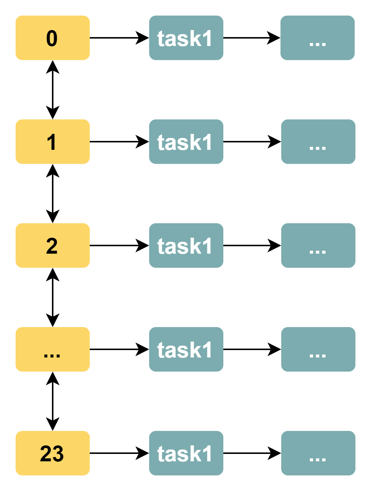
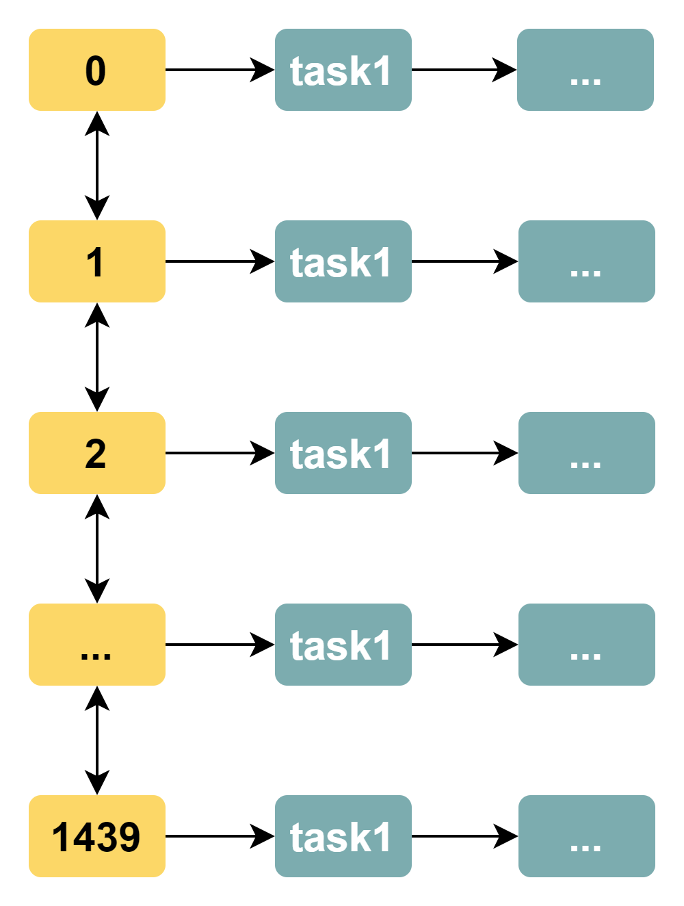
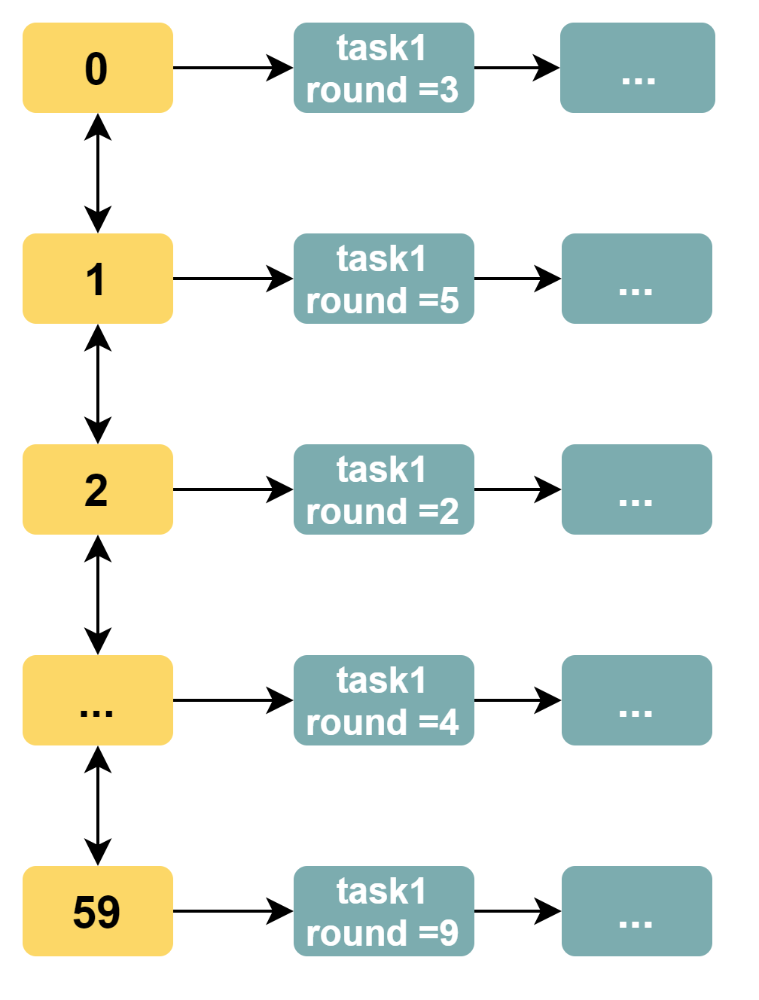
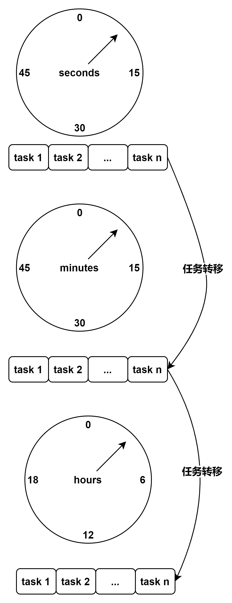

#Timer设计
时间轮算法
1. 基于队列的定时任务执行模型缺陷
在计算机世界中，只有待解决的问题变得大规模后，算法的价值才能够最大化的体现。时间轮算法可以将插入和删除操作的时间复杂度都降为 O(1)，在大规模问题下还能够达到非常好的运行效果。

如果我们要实现一个定时任务该如何实现呢？

最简单的方式就是使用一个任务队列来完成定时任务。具体实现细节下面详细展开。

1.线程模型

用户线程：负责定时任务的注册；
定时任务队列轮询线程：负责扫描任务队列上符合要求的任务，如果任务的时间戳达到规定的时刻，首先从队列中取走此任务，然后将其交给异步线程池来处理；
异步线程池：负责定时任务的执行；
2.定时任务

定时任务分为一次性执行的定时任务以及重复执行任务。

一次性执行的定时任务：任务在规定的某一个时刻就会被执行，但是仅仅会被执行一次。这好比大学时你告诉学霸室友：明天考试前提醒我去考试。因为该考试只会组织一次，因此学霸提醒你一次就够了。
重复执行的定时任务：任务在规定的某一个时刻会被执行后，将来的相同时刻需要被重复执行。这好比你上小学时告诉妈妈我每天 8:00 上学，你每天 7 点叫我起床。我们仅仅需要为每一个定时任务提供一个是否为定时任务的标签，定时任务队列轮询线程在发现此任务是需要重复执行的定时任务时，重新把定时任务注册到定时任务队列上。
3.任务队列数据结构

为了方便向任务队列中增减任务，通常会选择双向链表作为数据结构来实现任务队列。

这种方式不过是基于异步队列，然后为每一个任务提供一个时间戳字段。这种实现策略的问题在哪里？

如果有 1k 个任务，那么定时任务队列轮询线程每次都需要扫描 1k 个任务来确定哪一个任务达到规定时刻，这种轮询效率非常差，尤其是在大部分任务并没有达到规定执行时刻的情况下。

为了解决上述问题，我们可以使用如下两种方式：

有序任务队列；
任务分类+多队列+并发线程；
在计算机算法中，有序性通常能够显著提高遍历效率。我们现在将一个普通任务队列升级为一个按照任务执行的时间戳递增的有序任务队列。这样一来，定时任务队列轮询线程从头向尾遍历时，在发现任意线程未达到规定执行时间戳后，就可以停止遍历。此时，定时任务队列轮询线程甚至可以进行休眠操作，避免空轮询。

但是，有序性并非没有代价。插入一个定时任务的事件复杂度为 O(nlogn)，普通任务队列的插入仅仅是 O(1)。

我们再来看看另一种实现策略：任务分类+多队列+并发线程。这种方式主要是试图利用现代 CPU 的多核并发性来解决遍历效率低的问题。例如我们将 10k 大小的任务队列分为 10 个任务队列，此时每一个任务队列的大小仅仅是 1k。在线程完全并发执行的情况下，将 10k 规模的问题简化为 1k 规模的问题。

不过，多并发线程轮询的副作用非常大：线程是一种宝贵资源，如果一个系统有大量的定时调度任务，那么 CPU 会因为多条并发轮询线程而有着非常低的执行效率。

现在我们知道一个定时任务框架需要如下几个要素：

严格的数据结构：并不能基于简单的（有序或无序）的定时任务队列来存储定时任务，否则轮询线程的执行效率永远无法提高；
简单的并发模型：CPU 线程是非常宝贵的资源，轮询线程并不能太多；
时间轮算法解决了基于队列的定时任务执行模型的缺陷，下一节将详细介绍时间轮算法思想。

2. 时间轮算法思想
无论通过何种方式实现定时任务队列，最终需要向上层提供如下接口：

添加定时任务；
删除（取走）定时任务；
执行定时任务；
2.1 简单时间轮算法
时间轮算法的核心是：轮询线程不再负责遍历所有任务，而是仅仅遍历时间刻度。时间轮算法好比指针不断在时钟上旋转、遍历，如果一个发现某一时刻上有任务（任务队列），那么就会将任务队列上的所有任务都执行一遍。

时间轮算法不再将任务队列作为数据结构，其数据结构如下图所示（我们以小时为单位）：

图-1 时间轮数据结构示意图（黄色块为时间刻度，绿色块为任务）

显而易见，时间轮算法解决了遍历效率低的问题。时间轮算法中，轮询线程遍历到某一个时间刻度后，总是执行对应刻度上任务队列中的所有任务（通常是将任务扔给异步线程池来处理），而不再需要遍历检查所有任务的时间戳是否达到要求。

现在，即使有 10k 个任务，轮询线程也不必每轮遍历 10 k 个任务，而仅仅需要遍历 24 个时间刻度。

一个以小时为单位的时间轮算法就这么简单地实现了。不过，小时作为时间单位粒度太大，我们有时候会希望基于分钟作为时间刻度。最直接的方式是增加时间刻度，每一天有 24 * 60 = 1440。此时时间轮的数据结构如下：

图-2 时间精度为分钟的时间轮数据结构

通过增加时间刻度，我们可以基于更精细的时间单位（分钟）来进行定时任务的执行。但是，这种实现方式有如下的缺陷：

轮询线程遍历效率低问题：当时间刻度增多，而任务数较少时，轮询线程的遍历效率会下降，例如如果只有 50 个时间刻度上有任务，但却需要遍历 1440 个时间刻度。这违背了我们提出时间轮算法的初衷：解决遍历轮询线程遍历效率低的问题；
浪费内存空间问题：在时间刻度密集，任务数少的情况下，大部分时间刻度所占用的内存空间是没有任何意义的。
如果要将时间精度设为秒，那么整个时间轮将需要 86400 个单位的时间刻度，此时时间轮算法的遍历线程将遇到更大的运行效率低的问题。下面两个小节将着力解决此问题。

2.2 带有 round 的时间轮算法
我们发现，时间轮的时间刻度随着时间精度而增加并不是一个好的问题解决思路。现在，我们将时间轮的精度设置为秒，时间刻度个数固定为 60。每一个任务拥有一个 round 字段。

轮询线程的执行逻辑是：每隔一秒处理一个时间刻度上任务队列中的所有任务，任务的 round 字段减 1，接着判断如果 round 字段的值变为 0，那么将任务移出任务队列，交给异步线程池来执行对应任务。如果是重复执行任务，那么再将任务添加到任务队列中。

轮询线程遍历一次时间轮需要 60 秒。如果一个任务需要间隔 x 秒执行一次，那么其 round 字段的值为 x/60（整除），任务位于第 (x%60)（取余）个刻度对应的任务队列中。例如任务需要间隔 130 秒执行一次，那么 round 字段的值为 2，此任务位于第 10 号时间刻度的任务队列中。

此时时间轮算法的数据结构如下图所示：

图-3 时间精度为秒的 round 时间轮数据结构

这种方式虽然简化了时间轮的刻度个数，但是并没有简化轮询线程运行效率不高的问题。时间轮每次处理一个时间刻度，就需要处理其上任务队列的所有任务。其运行效率甚至与基于普通任务队列实现的定时任务框架没有区别。

2.3 分层时间轮算法
分层的时间轮算法在生活中有对应的模型（艺术来源于生活~），那就是水表：

此时，我们有秒、分钟、小时级别的三个时间轮，每一个时间轮分别有 60、60、24 个刻度。分层时间轮如下图所示：

图-4 一种分层时间轮数据结构

假设我们的任务需要在每天的 7:30:20 秒执行一次。任务首先添加于秒级别时钟轮的第 20 号刻度上，当其轮询线程访问到第 20 号刻度时，就将此任务转移到分钟级别时钟轮的第 30 号刻度上。当分钟级别的时钟轮线程访问到第 30 号刻度，就将此任务转移到小时级别时钟轮的第 7 号刻度上。当小时级别时钟轮线程访问到第 7 号刻度时，最终会将任务交给异步线程负责执行，然后将任务再次注册到秒级别的时间轮中。

这种分层时钟轮算法设计具有如下的优点：

轮询线程效率变高：首先不再需要计算 round 值，其次任务队列中的任务一旦被遍历，就是需要被处理的（没有空轮询问题）；
线程并发性好：虽然引入了并发线程，但是线程数仅仅和时钟轮的级数有关，并不随着任务数的增多而改变；
如果任务按照分钟级别来定时执行，那么当分钟时间轮达到对应刻度时，就会将任务交给异步线程来处理，然后将任务再次注册到秒级别的时钟轮上。

分层时间轮中的任务从一个时间轮转移到另一个时间轮，这类似于水表中小单位的表转弯一圈会导致高单位的表前进一个单位一样。