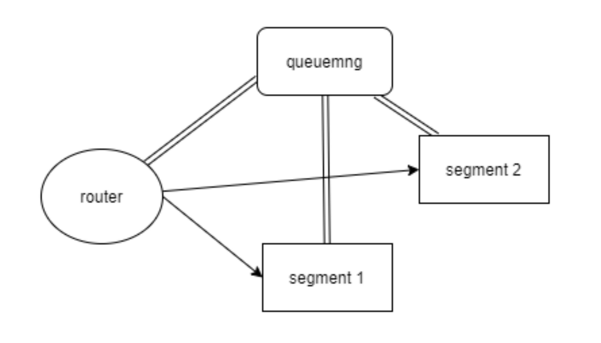
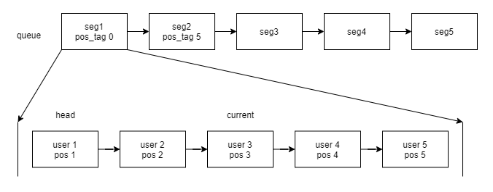
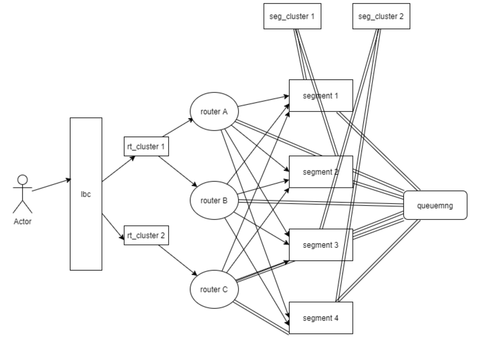
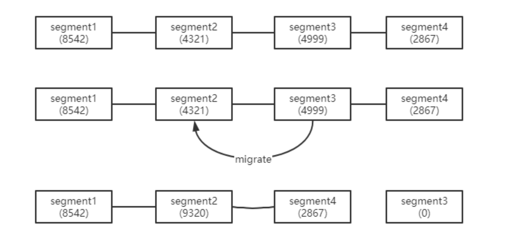

# 百万级排队服务
## 问题背景
缓解因开服或者开活动等场景大量玩家涌入而造成的服务器压力，起到保护后台服务的作用，排队系统就可以很好的解决这个问题。
##技术思路
* 要实现海量玩家排队的目标，服务应该做成一个分布式的队列，支持横向扩展。参考分段数组的思路，一个队列服务满了应能够自动分配下一个队列服务，各个队列服务间保持有序性，尽可能对用户透明，以http访问的方式方便各个产品接入  
* 放行用户通过队列的速率应可动态变化，后台服务繁忙的时候放行少量，后台服务不繁忙的时候增大放行。
## 技术实现

针对海量用户的需求，排队服要设计成可扩容的队列服务。 segment就是排队的服务，多个segment组成一个全局队列，segment1, segment2间的顺序由queuemng维护。用户从router进入，去segment1排队，当segment1排满了就排到segment2。  
### 各个角色服间的作用：
#### router
router是由rt_cluster启动,用户通过router 来请求后端的segment服务，对用户透明。
#### segment
segment是由seg_cluster启动，用来存储用户token和排名的队列，用户通过轮询的方式请求segment, 由于查询的频率相对于出队/入队/删除的操作比较频繁，故使用分段数组来实现segment上的queue
如下图 
每个seg是一个链表，并记录当前seg的位置偏移pos_tag  
**入队**：在最后的一个seg 插入，时间复杂度O(1)  
**查询**：当前链表上名次加上位置偏移。 pos_current – pos_head + 1 + pos_tag, 时间复杂度O(1)  
**删除**：在当前seg上删除，在向后更新其他seg的pos_tag, 时间复杂度O(m+n), m为seg的个数，n为seg的长度  
**出队**：向后更新其他seg的pos_tag, 时间复杂度O(m)，m为seg的个数  
#### queuemng
扩展到分布式，由queuemng管理各个队列服务segment，主要负责服务发现和维护segment链表，以及放行用户。  

**服务发现**：所有的router服务，segment服务都要事先配置queuemng的地址端口，当一个服务连上queuemng 服务后，由queuemng来通知其他在线的服务节点上线，断线也是通过queuemng通知其他服务节点下线  

**维护segment链表**：管理着一堆空闲的segment 和维护由若干个segment 服务串联起来的一个链表，链表的首部为出队的segment, 链表的尾部为入队的segment。 每个router记录当前入队的segment, router收到排队的请求便向入队segment 请求入队操作，每个segment限制了最大人数，如果入队segment没塞满，即返回该segment的serverid和一个唯一标识token ; 当入队segment 上的人数塞满了，该segment拒绝入队操作返回要求用户重新请求，并通知queuemng 分配下一个入队segment，并通知所有router 更新当前入队segment。 segment 上的每个用户设置了超时时间，长时间没收到用户的请求将其从该segment 上删除，当一个segment 上的用户数为零时会被queuemng 回收，待下次分配使用。  

**放行用户**：定时从服务监控后台monitor 拉取机器的监控数据，这个由配置文件 配置具体监控的进程实例，根据监控返回的CPU或者其他指标的数据和配置的放行挡位决定每次放行的用户数  
#### rt_cluster, seg_cluster
同理为了建立分布式的系统，我们需要创建多个router和多个segment，那么就需要东西去分配这样的资源。  
rt_cluster 以cluster.fork 创建子进程router，seg_cluster 以cluster.fork 创建子进程segment，一个rt_cluster/seg_cluster 对应一个配置文件，由rt_cluster/seg_cluster 去分配节点id 和节点的配置，扩容时只需增加一组cluster。

## 优化1
**问题：线上运行在高并发的情况下角色服rt_cluster CPU特别高**  
原因：在使用cluster.fork后会标记该进程是master还是child, 在调用net, dgram 网络模块 listen 时，child会通过管道发送消息给它所在的master，让master去listen，而后将连接rr分发给child，后续由child读写该连接的数据。

这种模式下虽然帮我们做了负载均衡，但是这种方式对于我们使用的短连接不友好，所有router的http连接建立都会经过一次rt_cluster，所以rt_cluster 的CPU才会特别高。  
rt_cluster 改进：  
**方案A**. 改成长连接，http 开启keep alive, 缓解父进程压力，貌似lbc 的那种七层的模型不允许设置http keep alive，故没采取这种  
**方案B**. 增多rt_cluster 数量，减少router 数量，减为1个，另特殊处理下只有一个router不使用fork

## 优化2
**整个系统的队列利用率不足**
如图，假设一台segment最多排10000人，中间的segment因为超时从队列中删除了，但只要该segment上的存在一个用户，该segment就不会被重新分配利用。  

queuemng会根据每个segemnt上报的用户数，检查当相邻两个segment的人数小于一个segment最大容量时，将靠后的segment的token合并到靠前的segment, 回收靠后的segment。迁移期间segment上的用户token自动保活，迁移后客户端首次访问靠后的segment，会让客户端重定向到靠前的segment，从而实现用户的迁移，这样就加快回收一个 segment服务，供queuemng再次分配使用

例如：segment2 + segment3 的用户数小于单个segment最大容量10000，queuemng就会向segment2和segment3发送migrate的信号， segment3就开始将用户token打包发送到segment2, 迁移过程中segment3的用户还是在segment3查询，等数据完全迁移过去后，segment3上原本的token查询就会被重定向到segment2， 同时segment3 就可以被回收利用了，提高整个排队系统segment的利用率。

 