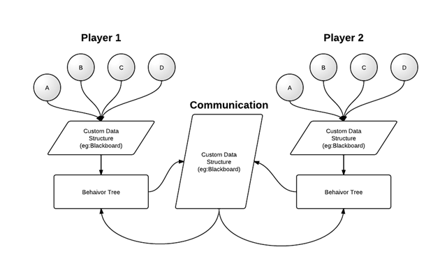

#行为树
黑板非常适合作为行为树的辅助模块来使用，这次就来谈谈如何在行为树中使用黑板。行为树的决策一般要依赖于外部的输入，如下图所示。

输入内容的来源取决于行为树用在整个AI架构的哪一层，可以是游戏世界的信息，或者是上层模块的输出。输入的形式，可以是分散的（Decentralized），也可以是集中的（Centralized）。举个例子来说，如果我们做一个战士是移动，还是攻击的决策，这是决策层的行为，所以输入内容就是游戏世界的信息，它可能包括战士自身状态（在模块A中），敌人状态（在模块B中），装备物品情况（在模块C），地图场景情况（在模块D中）等等，所以，当我们搜索和执行行为树时，我们需要从4个模块中获取信息来帮助决策，这样的方式就是我上面说的分散的方式，它的好处是调用非常直接（可能是用多个Singleton提供的接口），没有数据冗余，缺点是使得行为树对于数据的依赖度太分散。

集中的方式的话，就是我们可以定义一个数据结构专门用于行为树的输入，将上面提到的需要用到的数据，在进行行为树决策前，先从各个模块中收集到这个数据结构里，然后再递交给行为树使用。集中式的输入减少了输入和行为树之间的接口数量（只和预定义的数据结构通信），但缺点是，存在数据冗余。不过，我们可以看到集中式的数据输入使得行为树的表现更像一个黑盒了（可以伪造数据来测试行为树），这也是我们一直以来想要的。可以参看下面对于两种方式的示意图:

基于上面的原因，黑板（Blackboard）这样一个概念正好符合我们的需要，所以我们就可以用黑板从各个模块中来收集行为树决策和执行的过程中需要用到的数据，然后提交给行为树使用。值得注意的是，这块黑板对于行为树来说是只读（Readonly）的，行为树不允许修改和添加任何信息到这块黑板上面。因为很难从程序上去限制（就算用const，有时为了方便还能强转成非const），所以限制只能是一种规则，或者说约定。

说完了外部世界的黑板，我们再说说另一块可能会被用到的黑板。这也可以看成是对上面这块只读黑板的补偿吧，:)

在行为树的使用过程中，发现有时候节点和节点间，行为树和行为树之间确实需要有数据共享，比如对于序列（Sequence）节点来说，它的执行行为是依次执行每一个子节点，直白一点说的话，就是执行完一个再执行下一个。一般用到序列的行为，其子节点间总会有一些联系，这里就可能存在节点间通信的问题。再比如，在一些团队AI的决策过程中，当前AI的行为树决策可能需要参考其他AI的决策结果，所以这样就存在了行为树之间需要通信的情况。

所以，在实践过程中，我们还会定义另一块黑板来负责行为树间和节点间的通信需求，示意图如下:

可以看到这块黑板是又可以读又可以写的，为了防止黑板混乱的问题（可以参看我以前对于共享数据的文章），我们必须在使用时规定一些限制，可以称之为黑板数据的“作用域”，
我们知道很多编程语言里，变量都是存在作用域的概念的，有全局，有局部等等，借鉴于此，我也在这块黑板上规定了作用域，由上面的分析我们可以将黑板上的数据分成如下几种作用域:

* 全局域（G）：此数据可以给其他行为树访问  
* 行为树域（T）：此数据可以给行为树内的任意节点访问  
* 指定节点域（N）：此数据可以给指定的行为树内的某节点（可以是多个）访问  
这样的话，黑板的混乱程度就会好很多了，我们可以提供相关的接口来帮助操作黑板上的这些变量。