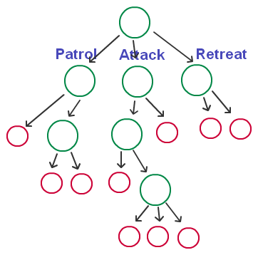
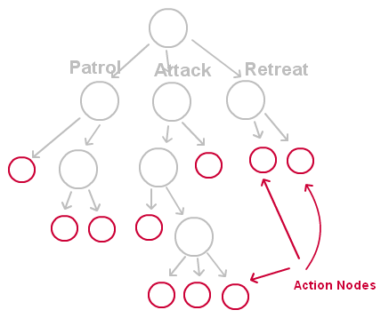
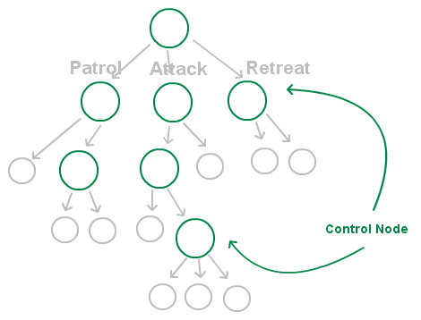

#行为树

一颗行为树，首先，可以看到这是一个树形结构的图，有根节点，有分支，而且子节点个数可以任意.
然后有三个分支，分别是巡逻（Patrol），攻击（Attack），逃跑（Retreat）.
这个三个分支可以看成是我们为这个士兵定义的三个大的行为（Behavior）.当然，如果有更多的行为，我们可以继续在根节点中添加新的分支。
当我们要决策当前这个士兵要做什么样的行为的时候，我们就会自顶向下的，通过一些条件来搜索这颗树.
最终确定需要做的行为（叶节点），并且执行它，这就是行为树的基本原理。  

我们标识的三大行为其实并不是真正的决策的结果，它只是一个类型，来帮助我们了解这个分支的一些行为是属于这类的，真正的行为树的行为都是在叶节点上，一般称之为行为节点（Action Node）

行为节点一般分为两种运行状态：
* 运行中（Executing）：该行为还在处理中
* 完成（Completed）：该行为处理完成，成功或者失败

除了行为节点，其余一般称之为控制节点（Control Node），用树的“学名”的话，就是那些父节点，如下图绿圈表示

## 控制节点
可以为行为树定义各种各样的控制节点（这也是行为树有意思的地方之一），一般来说，常用的控制节点有以下三种

* 选择（Selector）：选择其子节点的某一个执行
* 序列（Sequence）：将其所有子节点依次执行，也就是说当前一个返回“完成”状态后，再运行先一个子节点
* 并行（Parallel）：将其所有子节点都运行一遍