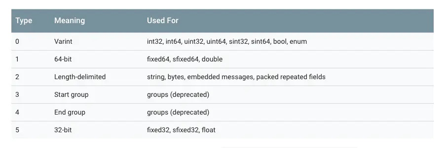

# Learn Google.ProtoBuf Theory Summary
protobuf会对proto协议文件进行序列化，最终转换成二进制数据，在这个转换过程中，protobuf做了一些优化，使得转换出来的二进制数据尽可能的小，同时也具有安全，编解码快等特点。
## 消息类型编码
protobuf会把message转成一系列的key-value，key就是字段号，value就是字段值
```
[tag1][value1][tag2][value2][tag3][value3]... 
```
解码时，会从左往右解析每一个key-value，假如遇到某个key-value无法解析了，那么就直接跳过，不会影响到其它key-value的解析，因此如果你加了新字段，生成字节流，然后用旧版本解析，这时它还是能够解析出旧版本的字段的，新字段只是被忽略而已，这就是protobuf的向后兼容。  
另外注意到，实际上存储的是tag-value，而不是key-value，根据key转换成tag  
```
tag = (key << 3) | wire_type(数据类型对应的整数值)
```

## 可变长编码类型
int32这些类型它并不是固定占用4个字节的  
protobuf具体的实现方法，就是把每个字节的最高位做为标志位，1表示当前字节不是最末尾的字节，0表示当前字节是最末尾的字节，举个例子，protobuf将404表示为：
```
10010100  00000011
```
它只占用两个字节，第一个字节的最高位为1，表示还需要读取下个字节，而第二个字节的最高位为0，表示不需要再读取下个字节了  
protobuf的解码是这样的：
* 去掉最高位，得到每个字节的低7位，也就是0010100 0000011。
* 然后倒序，得到11 0010100。
* 转成十进制，也就是404。
## 负数可变长编码类型
因为对于比较常用（数值比较大）的负数来说，转成补码后会有很多个1，也就是说占用的字节会比较多，这样如果还采用上面那种方式编码，就得不偿失了，因此Google又新增加了一种数据类型，叫sint，专门用来处理这些负数，其实现原理是采用zigzag编码，zigzag编码的映射函数为：
```
ZigZag(n) = (n << 1) ^ (n << k)，k为31或者63
```
最终的效果就是把所有的整数映射为正整数，比如0->0, -1->1, 1->1, -2->3这样子，然后就可以用上面所说的编码方式进行编码了，解码时通过逆函数解析即可
## 固定字节数类型
固定字节数，比如fixed32，它固定占用4个字节。而且可以看到，protobuf中float和double也是固定占用4个字节和8个字节，并没有实现压缩。
### string类型
按照固定的格式编码，格式为：
```
value = length(content占用的字节数，采用可变长编码) + content(string的具体内容)
```
## Protobuf实例解析
```
syntax="proto3";
// option java_outer_classname = "ProtoBufAnimal"
message Animal {
	int32 age = 1;
	string name = 2;
}
```
最终生成的二进制数据为：080C120468616861。
下面开始分析：

* 首先message是通过tag-value存储的，所以这里其实就是两个tag-value。
* 第一个tag-value对应的是age字段，其tag按照公式(key << 3) | wire_type计算，key为1，wire_type为0，最终结果为08，而value就是12采用可变长编码的结果，占用一个字节，最终结果为0C，因此第一个tag-value对应的就是前两个字节080C。
* 第二个tag-value对应的是name字段，其tag同样按照公式计算，key为2，wire_type为2，最终结果为12，value按照string数据类型的编码格式可知，刚开始是长度，后面是内容，因此先看内容，haha的十六进制表示为68616861，占用4个字节，所有长度就是4，也就是04，整个value表示为0468616861。
* 最后把两个tag-value拼接起来，就是080C120468616861，跟运行程序生成的一致。

protobuf最终生成的二进制数据有个特点就是紧凑，几乎不包含冗余数据，因此数据也会比较小。

## Protobuf优点:
* 小：生成的字节流采用了各种压缩方式，相对xml和json这类文件更小。


* 快：编解码基本都是位运算，也没有复杂的嵌套关系，速度快。


* 安全：这里的安全，是指protobuf没有把字段名写入到字节流里，只是写入了字段号信息。另外，相对于xml和json来说，因为被编码成二进制，破解成本增大。


* 向后兼容：解析器遇到无法解析的字段，会自动跳过，不影响其它字段的解析，因此新增字段生成的字节流还是可以用旧版本的proto文件代码解析。


* 语言无关和平台无关：把proto文件转成字节流，可以采用不同的语言，比如后台用C++，客户端用Java或者Python等，字节流转具体对象可以根据需要自行选择语言。也就是说整个编解码过程完全不依赖某种语言的特性。
