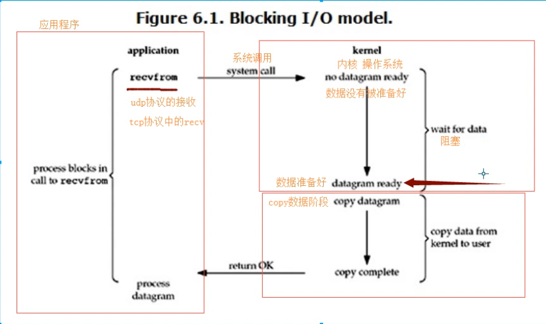
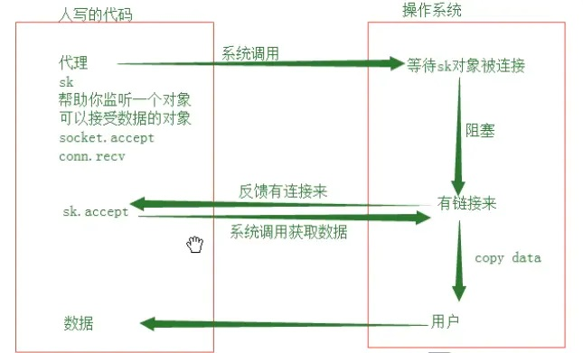

#Learn IO summary
同步：提交一个任务之后要等待这个任务执行完毕

异步：只管提交任务，不等待这个任务执行完毕就可以做其它的事情

阻塞：当用户线程发出IO请求之后，内核会去查看数据是否就绪，如果没有就绪就会等待数据就绪，而用户线程就会处于阻塞状态，用户线程交出CPU。当数据就绪之后，内核会将数据拷贝到用户线程，并返回结果给用户线程，用户线程才解除block状态。(例如：在socket中的这些recvfrom，recv，accept都会产生阻塞。)

非阻塞：**当用户线程发起一个read操作后，并不需要等待，而是马上就得到了一个结果。** 如果结果是一个error时，它就知道数据还没有准备好，于是它可以再次发送read操作。一旦内核中的数据准备好了，并且又再次收到了用户线程的请求，那么它马上就将数据拷贝到了用户线程，然后返回。
       (所以事实上，在非阻塞IO模型中，用户线程需要不断地询问内核数据是否就绪，也就说非阻塞IO不会交出CPU，而会一直占用CPU。)
       
###在linux中，默认情况下所有的socket都是blocking，一个读操作的大致流程如下：

1、当用户进程调用了recvfrom这个系统调用，kernel就开始了IO的第一个阶段：准备数据。对于network io来说，很多时候数据在一开始还没有到达（比如，还没有收到一个完整的UDP包），这个时候kernel就要等待足够的数据到来。

2、而在用户进程这边，整个进程会被阻塞。当kernel一直等到数据准备好了，它就会将数据从kernel中拷贝到用户内存，然后kernel返回结果，用户进程才解除block的状态，重新运行起来。

**所以，blocking IO的特点就是在IO执行的两个阶段（等待数据和拷贝数据两个阶段）都被block了。**
几乎所有的IO接口 ( 包括socket接口 ) 都是阻塞型的。这给网络编程带来了一个很大的问题，如在调用recv(1024)的同时，线程将被阻塞，在此期间，线程将无法执行任何运算或响应任何的网络请求。

###Linux下，可以通过设置socket使其变为non-blocking。当对一个non-blocking socket执行读操作时，流程是这个样子

从图中可以看出，当用户进程发出read操作时，如果kernel中的数据还没有准备好，那么它并不会block用户进程，而是立刻返回一个error。从用户进程角度讲 ，它发起一个read操作后，并不需要等待，而是马上就得到了一个结果。用户进程判断结果是一个error时，它就知道数据还没有准备好，于是用户就可以在本次到下次再发起read询问的时间间隔内做其他事情，或者直接再次发送read操作。一旦kernel中的数据准备好了，并且又再次收到了用户进程的system call，那么它马上就将数据拷贝到了用户内存（这一阶段仍然是阻塞的），然后返回。

也就是说非阻塞的recvform系统调用之后，进程并没有被阻塞，内核马上返回给进程，如果数据还没准备好，此时会返回一个error。进程在返回之后，可以干点别的事情，然后再发起recvform系统调用。重复上面的过程，循环往复的进行recvform系统调用。这个过程通常被称之为轮询。轮询检查内核数据，直到数据准备好，再拷贝数据到进程，进行数据处理。需要注意，拷贝数据整个过程，进程仍然是属于阻塞的状态。

**所以，在非阻塞式IO中，用户进程其实是需要不断的主动询问kernel数据准备好了没有。**
##多路复用IO(IO multiplexing)
**也就是单个process就可以同时处理多个网络连接的IO.** 通常select poll epoll三个方法。详解见[select详解](./Multiple%20Client%20Connections/python%20select模块详解.md)
select/epoll的好处就在于单个process就可以同时处理多个网络连接的IO。它的基本原理就是select/epoll这个function会不断的轮询所负责的所有socket，当某个socket有数据到达了，就通知用户进程。

当用户进程调用了select，那么整个进程会被block，而同时，kernel会“监视”所有select负责的socket，当任何一个socket中的数据准备好了，select就会返回。这个时候用户进程再调用read操作，将数据从kernel拷贝到用户进程。

**强调：**  
1.如果处理的连接数不是很高的话，使用select/epoll的web server不一定比使用multi-threading + blocking IO的web server性能更好，可能延迟还更大。select/epoll的优势并不是对于单个连接能处理得更快，而是在于能处理更多的连接。

2. 在多路复用模型中，对于每一个socket，一般都设置成为non-blocking，但是，如上图所示，整个用户的process其实是一直被block的。只不过process是被select这个函数block，而不是被socket IO给block。

**结论: select的优势在于可以处理多个连接，不适用于单个连接** 

优点：

相比其他模型，使用select() 的事件驱动模型只用单线程（进程）执行，占用资源少，不消耗太多 CPU，同时能够为多客户端提供服务。如果试图建立一个简单的事件驱动的服务器程序，这个模型有一定的参考价值。

缺点：

首先select()接口并不是实现“事件驱动”的最好选择。因为当需要探测的句柄值较大时，select()接口本身需要消耗大量时间去轮询各个句柄。window提供select（）机制

很多操作系统提供了更为高效的接口，如linux提供了epoll，BSD提供了kqueue，Solaris提供了/dev/poll，…。Linux 也有select（）、poll机制

使用类似于epoll的接口实现具有较好跨平台能力的服务器会比较困难。其次，该模型将事件探测和事件响应夹杂在一起，一旦事件响应的执行体庞大，则对整个模型是灾难性的。
