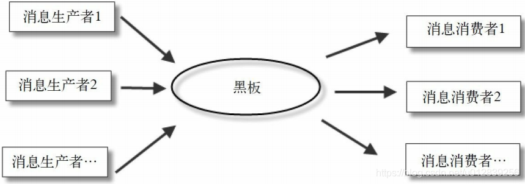

#黑板模式
黑板模式是观察者模式的扩展。允许消息的读写同时进行，广泛地交互消息。  
黑板模式允许多个消息读写者同时存在，消息的生产者和消费者完全分开，两者在空间和时间上可以解耦，并且互不干扰。  

黑板模式是消息的广播，主要解决消息的生产者和消费者之间的耦合问题，核心是消息存储（黑板），它存储所有消息，并可以随时被读取。当然，消息的写入者也可以变身为消息的阅读者，读写者在时间上解耦。对于这些消息，消费者只需要关注特定消息，不处理与自己不相关的消息，这一点通常通过过滤器来实现。  
## 黑板架构风格
基于上面的描述，我们可以看到黑板有几个功能：
* 记录：每个人可以写下自己的看法。
* 更新：调整已有的看法。
* 删除：删除对于过时的，或者错误的看法。
* 读取：黑板上的内容谁都能自由阅读。  

所以从本质上来说，黑板就是这样一个共享数据的结构，它对于多个系统间通信是很有帮助的。它提供一种数据传递的方式，有助于系统的封装和解耦合。

对于各个子系统而言，只需要把自己的运算的结果数据记录在黑板上，至于这个数据谁会去用，并不需要关心。  
反过来也是一样，对于自己的运算时需要用到的数据，可以从黑板上去获取，至于这个数据是谁提供的，也不需要关心。  
只要这个数据在黑板上，就够可以认为是合法数据，这就提供的了一种灵活性，各个子系统的设计也会相对独立。  